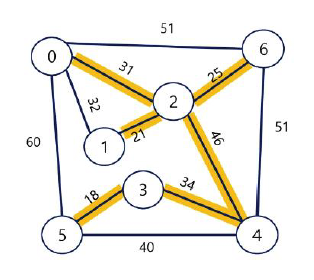

## 최소 비용 신장 트리 - MST

[인트로]

트리란, 사이클이 없는 그래프

그 중에서 최소 비용 문제를 해결하기 위한 트리가 있고,

우리는 **"모든 정점을 연결하는 간선들의 가중치의 합이 최소가 되는"** 트리를 찾으면 된다.

### 신장 트리

N개의 정점으로 이루어진 무방향 그래프에서 N개의 정점과 N-1개의 간선으로 이루어진 트리

-> 그래프의 모든 정점을 포함하면서 사이클이 없는 트리 (모든 섬을 연결하는 하나의 방법)

### 최소 신장 트리 (MST, Minimum Spanning Tree)

무방향 가중치 그래프에서 신장 트리를 구성하는 간선들의 가중치 합이 최소인 신장 트리

-> **여러 신장 트리**(한 그래프에서 여러 개의 신장 트리가 나올 수 있다) 중에
    간선의 가중치 합이 가장 작은 트리 = 비용이 가장 적게 드는 연결법

이를 해결하기 위해서, 
앞으로는 가중치도 함께 저장을 해주어야 한다.

이제는 MST를 찾기 위한 두 가지 알고리즘을 설명하겠다.

이 파일에서는 해당 개념과 관련한 아이디어를 우선 다룬다.

둘 다 그리디처럼 고르게 되는데

약간의 차이가 있다.

1. (간선) 작은 가중치부터 선택하되, 사이클이 발생하지 않도록 처리해준다. - 이게 Kruskal
2. (정점) BFS처럼 접근하되, 작은 가중치를 고른다. - 이게 Prim 이다.

### Prim 알고리즘 - 정점을 선택하자

**<u>하나의 정점</u>**에서 연결된 간선들 중에 하나씩 선택하면서 MST를 만들어 가는 방식

-> BFS처럼 접근한다고 생각하면 이해하기 수월하다.

1. 임의 정점을 하나 선택해서 시작
2. 선택한 정점과 인접하는 정점들 중의 **최소 비용의 간선이 존재하는 정점**을 선택
3. 모든 정점이 선택될 때까지 1, 2 과정을 반복

### Kruskal 알고리즘 - 간선을 선택하자

1. **<u>간선</u>**을 하나씩 선택해서 MST를 찾는 알고리즘
   1. 최초, 모든 간선을 가중치에 따라 오름차순으로 정렬
   2. 가중치가 낮은 간선부터 선택하면서 트리를 증가시킴
      - 사이클이 존재하면 다음으로 가중치가 낮은 간선 선택
        - 이를 구현하기 위해서, **서로소 집합 자료구조**를 활용한다.
   3. n-1개의 간선이 선택될 때까지 2를 반복

### 결론

1. MST가 무엇인지 이해하자

2. 알고리즘 두 가지 : 언제 무엇을 선택해야할까?

   1. 정점을 기준으로 갈 수 있는 것 중 가장 적은 곳으로 먼저 가자 = prim
   2. 간선을 기준으로 가중치가 적은 간선부터 선택하자 = Kruskal

   - 간선이 많을수록(완전 그래프 like) 뭐가 더 유리할까? ;  prim
   - 보통 그래프이거나, 희소 그래프일수록 뭐가 더 유리할까? ; kruskal
